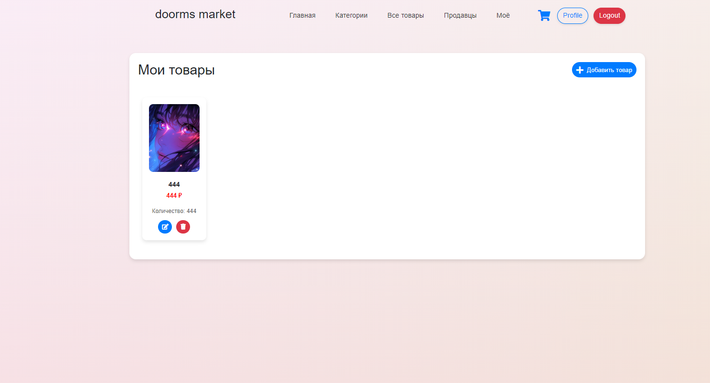
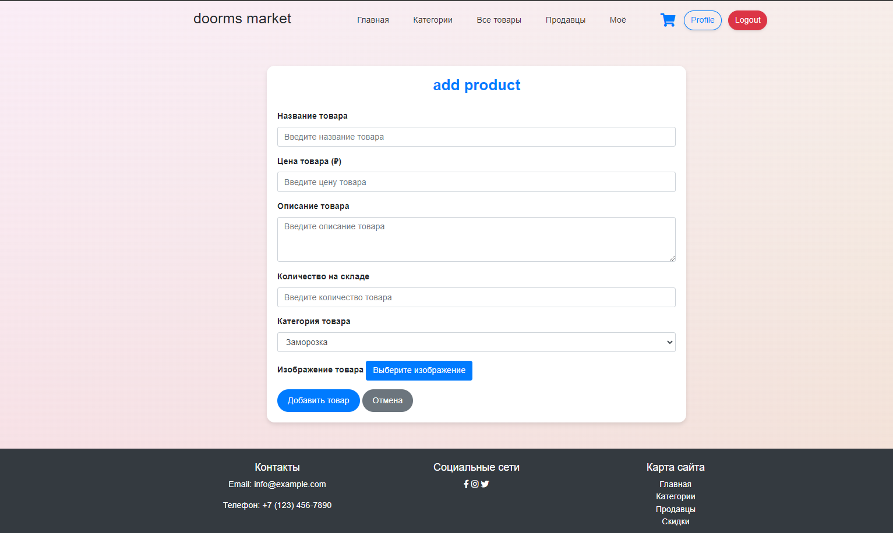

## dorms market - платформа для продажы

## Стек
1. Java 17 + Spring Boot
2. Spring Security + JWT
3. Web
    - Верстка: HTML5, CSS, JS
    - Запросы: AJAX JS
4. БД:
    - PostgreSQL
    - Redis
5. Liquibase - миграция БД
6. Docker развертка
7. (_В теории_
    - _Kafka_ - брокер
    - _Kubernetes_ - оркестрация
    - _Jenkins_ - CI/CD)
8. Для тестов: JUnit

## инсутркция:
1. **перейти cd .\docker**
2. сменить порты если потребуется, и указать url бд в 
app properties (то же название что и в композ файле POSTGRES_DB=task_db)(название)
2. **docker compose up (сменить порт если потребуется)**
3. **run application**
4. **документация по http://localhost:8080/swagger-ui/index.html**

## screens

